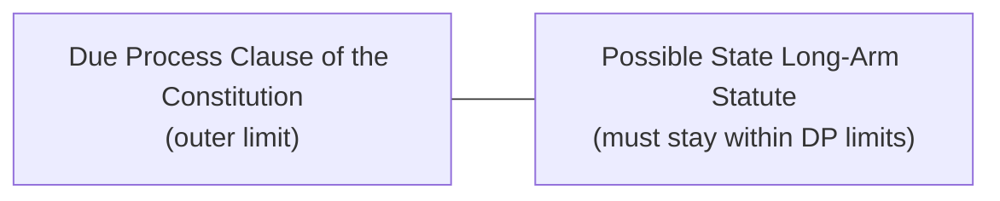

---
tags:
  - civpro
  - civpro/diagram
---

```mermaid
flowchart LR
  A["Due Process Clause of the Constitution<br/>(outer limit)"] --- B["Possible State Long-Arm Statute<br/>(must stay within DP limits)"]
```
